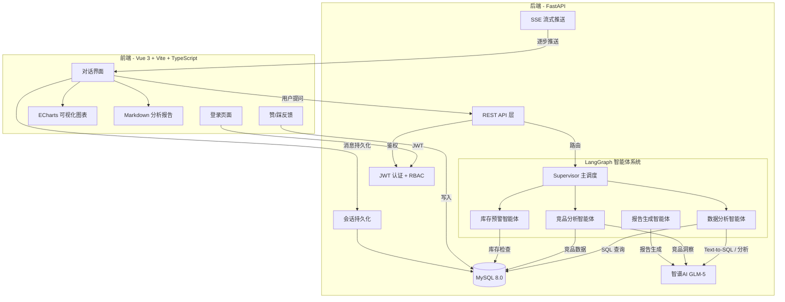
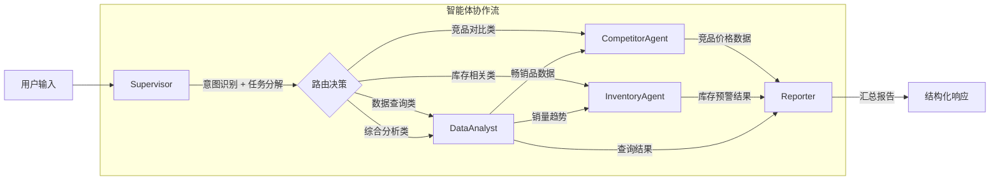
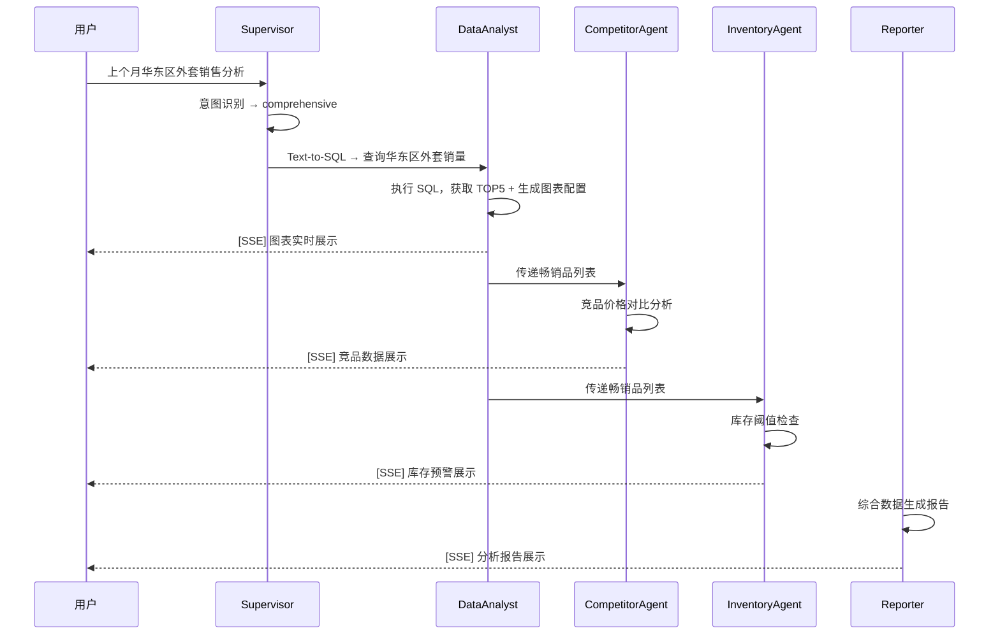

# DataMind — 电商数据与业务洞察多智能体系统

> 基于 **LangGraph 多智能体协作** + **RBAC 权限体系** 的电商数据分析平台。  
> 用户以自然语言提问，系统通过 Supervisor 调度多个专业智能体协作完成 Text-to-SQL、竞品分析、库存预警，  
> 并以 **SSE 流式推送** 实时展示各阶段结果，最终生成 ECharts 可视化图表与 Markdown 分析报告。

---
## 网页展示


https://github.com/user-attachments/assets/14dd7c2a-c771-467f-8315-ac682d323e0a


---

## 目录

- [系统架构](#系统架构)
- [多智能体协作](#多智能体协作)
- [功能特性](#功能特性)
- [技术栈](#技术栈)
- [数据库设计](#数据库设计)
- [快速开始](#快速开始)
- [部署方式](#部署方式)
- [典型使用场景](#典型使用场景)
- [模拟数据说明](#模拟数据说明)

---

## 系统架构



## 多智能体协作



### 五个智能体节点

| 智能体 | 职责 | 核心能力 |
|--------|------|----------|
| **Supervisor** | 意图识别、任务路由 | 5 类意图分类（data_query / data_analysis / competitor_analysis / inventory_check / comprehensive） |
| **DataAnalyst** | Text-to-SQL、数据查询、图表生成 | SQL 生成 + 自动纠错（最多 2 次重试）、ECharts 配置生成、降级柱状图 |
| **CompetitorAgent** | 竞品价格爬取与分析 | 竞品数据聚合、价格竞争力分析 |
| **InventoryAgent** | 库存检查与预警 | 阈值检测、紧急/预警分级、补货建议 |
| **Reporter** | 综合分析报告生成 | 多源数据融合、Markdown 结构化输出 |

---

## 功能特性

### 用户认证与权限管理

- **RBAC 模型**：角色（admin / analyst / viewer）→ 权限（chat:query / chat:export / feedback:submit / admin:user_manage 等）
- **JWT 认证**：登录获取 token，所有 API 接口均受 Bearer Token 保护
- **登录页面**：支持快捷选择演示账号，输入框聚焦动效，错误提示
- **退出功能**：侧边栏底部显示当前用户昵称与角色，一键退出

| 预置账号 | 密码 | 角色 | 权限说明 |
|----------|------|------|----------|
| admin | admin123 | 管理员 | 全部权限 |
| analyst | analyst123 | 分析师 | 查询、导出、反馈、查看报告 |
| demo | demo123 | 分析师 | 同上，用于演示 |

### SSE 流式渐进展示

- 后端将 agent 图拆分为逐步执行（`run_agent_stepwise`），每个节点完成后通过 **SSE** 实时推送中间结果
- 前端收到 step 事件后增量渲染：意图标签 → SQL 折叠 → 图表 → 库存预警 → 分析报告
- 用户不再干等全部完成，每个阶段出结果即可见

### 对话历史持久化

- **数据库存储**：`chat_sessions` + `chat_messages` 表，按 `user_id` 严格隔离
- **懒加载**：登录后只拉取会话摘要列表（标题、时间、消息数），点击某个会话才从数据库加载完整消息
- **前端缓存**：已加载的会话消息缓存在内存中，切换回来时无需再次请求
- **分组折叠**：侧边栏历史按"今天 / 最近7天 / 更早"分组显示，"更早"默认折叠只显示 3 条
- **上限截断**：最多加载最近 100 个会话，避免一次性拉取过多数据
- **跨设备同步**：同一账号在不同浏览器/电脑登录看到的是相同的对话历史

### 回答质量反馈（复盘）

- 每条 AI 回答底部提供 **赞 / 踩** 按钮
- 点击后写入 `feedbacks` 表，记录 `user_id`、`session_id`、`message_id`、`query`、`rating`
- 同一用户对同一消息重复操作会更新而非重复插入
- 反馈数据可用于后期模型效果评估和 prompt 优化

### SQL 折叠展示

- 查询 SQL 默认收起为一个可点击的标签
- 点击展开/收起，带平滑过渡动画

---

## 技术栈

| 层 | 技术 | 说明 |
|----|------|------|
| 前端 | Vue 3 + Vite + TypeScript | SFC 组件化，Composition API |
| 状态管理 | Pinia | 响应式 store，会话状态管理 |
| 可视化 | ECharts + vue-echarts | LLM 生成图表配置，前端渲染 |
| 路由 | Vue Router | 登录页 / 主页路由，导航守卫 |
| 后端 | FastAPI (Python 3.11+) | 异步高性能，自动 OpenAPI 文档 |
| 智能体 | LangGraph | StateGraph 有向图编排，条件路由 |
| LLM | 智谱 AI GLM-5 (zai-sdk) | Text-to-SQL、分析报告、图表配置生成 |
| 认证 | JWT (python-jose) + bcrypt | 无状态令牌认证 |
| 数据库 | MySQL 8.0 + SQLAlchemy | 异步 aiomysql + 同步 pymysql 双引擎 |
| 通信 | SSE (Server-Sent Events) | 后端 queue + thread 实现真正逐步推送 |

---

## 数据库设计

共 **11 张表**，分为三组：

### RBAC 权限体系

```
roles ──< role_permissions >── permissions
  │
  └──< users ──< feedbacks
```

| 表 | 说明 |
|----|------|
| `roles` | 角色定义（admin / analyst / viewer），含 display_name、description |
| `permissions` | 权限编码（chat:query / admin:user_manage 等），含说明 |
| `role_permissions` | 角色-权限多对多关联 |
| `users` | 用户信息，含 bcrypt 密码哈希、角色外键、is_active 启禁用标记 |

### 对话与反馈

```
users ──< chat_sessions ──< chat_messages
  │
  └──< feedbacks
```

| 表 | 说明 |
|----|------|
| `chat_sessions` | 会话记录，按 user_id 隔离，存储标题和时间戳 |
| `chat_messages` | 消息记录，role(user/assistant)、content、data_json(结构化数据)、feedback |
| `feedbacks` | 赞/踩记录，关联 user_id + message_id，用于后期复盘 |

### 电商业务

```
products ──< orders
    │──── inventory
    └──── competitors
```

| 表 | 说明 |
|----|------|
| `products` | 30 款商品，覆盖 5 大品类 × 5 个区域 |
| `orders` | 42000+ 订单，跨 6 个月，含渠道/客群/时间维度 |
| `inventory` | 库存与预警阈值，部分爆款设置低库存 |
| `competitors` | 15 条竞品记录，覆盖三大平台 |

所有表字段均带有 `comment` 备注，方便后续开发者理解和扩展。

---

## 快速开始

### 环境要求

- Python 3.11+
- Node.js 18+
- MySQL 8.0

### 1. 后端

```bash
cd backend

# 安装依赖
pip install -r requirements.txt

# 配置 .env（已预设默认值，按需修改）
# ZHIPUAI_API_KEY=xxx
# MYSQL_HOST=192.168.50.126
# JWT_SECRET=your-secret

# 初始化数据库（建表 + RBAC + 模拟数据）
python -m app.database.seed

# 启动服务
uvicorn app.main:app --host 0.0.0.0 --port 8000 --reload
```

### 2. 前端（开发模式）

```bash
cd frontend
npm install
npm run dev
# 访问 http://localhost:3000
```

---

## 部署方式

### 方式一：开发模式（前后端分离）

前端 `localhost:3000`（Vite dev server）通过 proxy 转发 `/api` 到后端 `localhost:8000`。

### 方式二：生产模式（无需 Nginx）

```bash
# 1. 构建前端
cd frontend && npm run build

# 2. 只启动后端
cd backend
uvicorn app.main:app --host 0.0.0.0 --port 8000
```

FastAPI 自动检测 `frontend/dist` 目录，挂载静态资源并对所有非 `/api` 路径做 SPA fallback。  
直接访问 `http://your-server:8000` 即可使用完整系统。

---

## 典型使用场景

### 场景 1：综合销售分析（触发全部智能体）

> **输入**：帮我看看上个月华东区哪几款外套卖得最好，并分析原因



### 场景 2：渠道趋势分析

> **输入**：分析一下最近三个月各渠道的销售额占比和趋势变化

**流程**：Supervisor → DataAnalyst（按渠道+月份聚合，生成饼图/折线图）→ Reporter

### 场景 3：竞品价格对比

> **输入**：把我们的爆款商品和竞品的价格对比一下

**流程**：Supervisor → DataAnalyst（查出爆款列表）→ CompetitorAgent（拉取竞品价格对比）→ Reporter

### 场景 4：库存预警

> **输入**：检查一下当前库存情况，哪些商品需要紧急补货？

**流程**：Supervisor → InventoryAgent（全量库存扫描、紧急/预警分级）→ Reporter

### 场景 5：客群画像

> **输入**：分析25-34岁客户群体最喜欢买什么品类，客单价是多少

### 场景 6：大促效果复盘

> **输入**：帮我复盘去年12月的销售数据，和11月对比看看增长情况

---

## 模拟数据说明

`python -m app.database.seed` 会在 MySQL 中生成以下数据：

| 数据类型 | 规模 | 特点 |
|----------|------|------|
| RBAC | 3 角色、6 权限、3 用户 | admin/analyst/viewer 三级权限 |
| 商品 | 30 款 | 覆盖外套/T恤/裤子/连衣裙/卫衣 × 华东/华南/华北/华中/西南 |
| 订单 | 42000+ 条 | 2025.10 – 2026.03 共 6 个月，模拟季节波动与大促峰值 |
| 库存 | 30 条 | 爆款设置低库存触发预警 |
| 竞品 | 15 条 | 覆盖天猫/京东/拼多多，含价格优劣势 |

**数据分布特点**：
- 双11/双12 订单量显著峰值（月系数 1.3/1.5）
- 外套品类冬季权重 ×2.0，T恤夏季权重 ×0.3
- 华东区域销售占比 35%，西南 8%
- 5 个销售渠道按 天猫30% > 京东25% > 抖音20% > 小红书15% > 线下10% 分布
- 客群年龄以 25-34 岁为主（40%）

---

## 项目结构

```
business_agent/
├── backend/
│   ├── app/
│   │   ├── agents/          # 智能体实现
│   │   │   ├── graph.py     # LangGraph 状态图 + 逐步执行器
│   │   │   ├── supervisor.py
│   │   │   ├── data_analyst.py
│   │   │   ├── competitor.py
│   │   │   └── inventory.py
│   │   ├── api/
│   │   │   └── routes.py    # 全部 API 端点（认证/会话/对话/反馈）
│   │   ├── database/
│   │   │   ├── models.py    # 11 张表的 ORM 定义
│   │   │   ├── connection.py
│   │   │   └── seed.py      # 数据初始化脚本
│   │   ├── llm/
│   │   │   ├── client.py    # GLM-5 封装 + 调用日志
│   │   │   └── prompts.py   # Text-to-SQL / 分析 / 图表 prompt
│   │   ├── schemas/
│   │   │   └── response.py  # Pydantic 请求/响应模型
│   │   ├── tools/            # 智能体工具（SQL执行/爬虫/库存检查）
│   │   ├── auth.py           # JWT + bcrypt 认证
│   │   ├── config.py         # 配置管理 (pydantic-settings)
│   │   └── main.py           # FastAPI 入口 + 静态文件托管
│   ├── requirements.txt
│   └── .env
├── frontend/
│   ├── src/
│   │   ├── views/            # LoginView / ChatView
│   │   ├── components/       # MessageBubble / ChartPanel / DetailPanel ...
│   │   ├── stores/           # auth.ts / chat.ts (Pinia)
│   │   ├── api/              # agent.ts (axios + SSE)
│   │   └── router/           # 路由 + 导航守卫
│   ├── package.json
│   └── vite.config.ts
└── README.md
```

